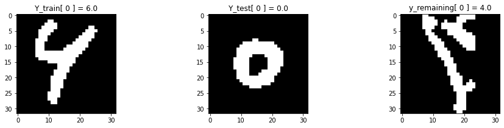
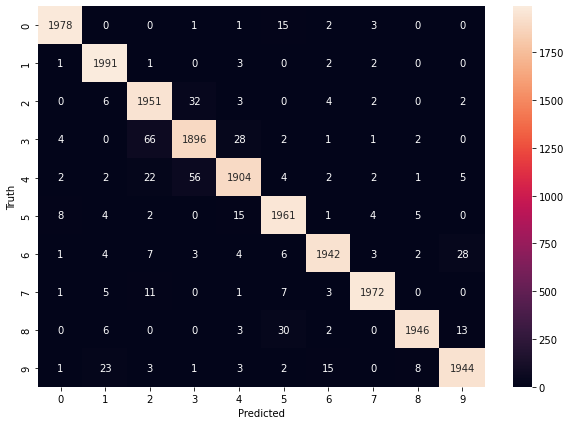
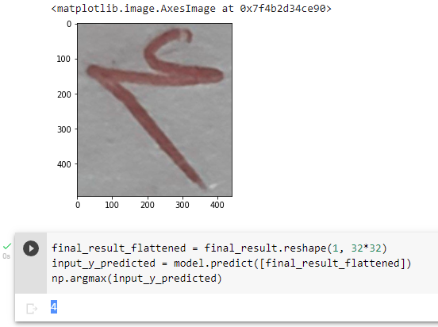

# Persian Handwritten Digit Recognition using TensorFlow

## Dataset
The name of the dataset used is Hoda and you can know more in this [link](http://farsiocr.ir/%D9%85%D8%AC%D9%85%D9%88%D8%B9%D9%87-%D8%AF%D8%A7%D8%AF%D9%87/%D9%85%D8%AC%D9%85%D9%88%D8%B9%D9%87-%D8%A7%D8%B1%D9%82%D8%A7%D9%85-%D8%AF%D8%B3%D8%AA%D9%86%D9%88%DB%8C%D8%B3-%D9%87%D8%AF%DB%8C/). Contains 60,000 data for training, 20,000 for testing and more than 22,000 as RemainingSamples.
The dataset was in .CDB format so for reading, I used [HodaDatasetReader](https://github.com/amir-saniyan/HodaDatasetReader) from *Amir Saniyan*.

 

## Structure
It's very simple. A neural network with only one hidden layer using TensorFlow.
Accuracy is 0.9982 on training set and 0.9758 on test set.

 
 
